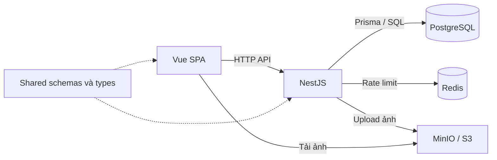

# ShopFlow

Ứng dụng thương mại điện tử bán áo thun in sẵn cho thị trường Việt Nam, gồm cửa hàng
cho khách và khu vực quản trị sản phẩm, tồn kho, đơn hàng.

Dự án full-stack với trọng tâm backend: xử lý đặt hàng đồng thời, chống tạo trùng đơn
và giữ chính xác thông tin mua hàng. Tồn kho được quản lý theo từng SKU màu × size.
Ba ưu tiên thiết kế là **đơn hàng và tiền phải chính xác → một người vận hành được →
chi phí tương xứng lưu lượng**.

## Chức năng chính

| Khách hàng                                         | Quản trị viên                                 |
| -------------------------------------------------- | --------------------------------------------- |
| Tìm kiếm, lọc sản phẩm; chọn màu và size           | Tạo, cập nhật và lưu trữ sản phẩm             |
| Giỏ hàng khi chưa đăng nhập; gộp giỏ khi đăng nhập | Quản lý biến thể, giá, tồn kho và ảnh         |
| Đăng ký, đăng nhập và duy trì phiên                | Xem, lọc và xử lý đơn hàng                    |
| Đặt hàng, xem lịch sử và chi tiết đơn              | Chuyển trạng thái đơn theo quy tắc nghiệp vụ  |
| Hủy đơn khi còn chờ xác nhận                       | Hủy đơn ở trạng thái cho phép và hoàn tồn kho |

## Điểm kỹ thuật nổi bật

- **Chống bán vượt tồn:** trừ tồn có điều kiện trong transaction. Có
  [integration test](apps/api/src/modules/orders/orders.service.int.test.ts) cho
  20 yêu cầu cùng mua SKU chỉ còn một sản phẩm.
- **Chống tạo trùng đơn:** dùng idempotency key để trả lại đơn đã tạo khi client
  gửi lại yêu cầu; không trừ tồn lần hai.
- **Giữ đúng dữ liệu mua hàng:** lưu tên, SKU và giá tại thời điểm đặt trên dòng đơn.
  Tiền VND dùng số nguyên, truyền qua JSON dạng chuỗi.
- **Xác thực và phân quyền phía API:** JWT, refresh token trong cookie HttpOnly,
  kiểm tra vai trò và quyền sở hữu đơn hàng; Redis lưu bộ đếm rate limit.
- **Hợp đồng dùng chung:** schema Zod và kiểu dữ liệu trong `packages/shared` phục
  vụ frontend, backend và tài liệu OpenAPI. Frontend dùng Pinia cho phiên đăng nhập
  và TanStack Query cho dữ liệu từ API.

## Công nghệ và kiến trúc

| Thành phần          | Công nghệ                                                            |
| ------------------- | -------------------------------------------------------------------- |
| Frontend            | Vue 3, TypeScript, Vite, Tailwind CSS, Pinia, TanStack Query         |
| Backend             | NestJS, Prisma, Zod, OpenAPI/Swagger                                 |
| Dữ liệu             | PostgreSQL 16, Redis                                                 |
| Ảnh sản phẩm        | MinIO khi phát triển; tích hợp S3 qua AWS SDK                        |
| Kiểm thử            | Vitest, Vue Test Utils, Testcontainers                               |
| Build và triển khai | pnpm workspaces, Docker, GitHub Actions; cấu hình AWS bằng Terraform |

Backend tổ chức theo các module Auth, Catalog, Cart và Orders trong cùng một ứng dụng NestJS.



```text
apps/web/        Giao diện khách hàng và quản trị
apps/api/        API, nghiệp vụ, Prisma schema và migrations
packages/shared/ Schema, kiểu dữ liệu và hàm dùng chung
infra/           Terraform và cấu hình phục vụ web
docs/            Hướng dẫn phát triển và bài tập SQL
```

## Chạy nhanh

Yêu cầu: Docker + Docker Compose, Node.js 22 trở lên và pnpm theo phiên bản
`packageManager` trong [package.json](package.json).

```bash
cp .env.example .env
```

Điền `POSTGRES_PASSWORD`, `JWT_SECRET`, `MINIO_ROOT_PASSWORD` trong `.env`.
Trên Linux/WSL dùng Docker trực tiếp, đặt `DOCKER_UID` và `DOCKER_GID` theo kết quả
`id -u` và `id -g`. Xem [hướng dẫn môi trường](docs/development.md) nếu cần đổi cổng.

```bash
pnpm install --frozen-lockfile
docker compose up -d --build
```

Khi API container đã khởi động, áp dụng migration và nạp dữ liệu mẫu:

```bash
docker compose exec -w /app/apps/api api pnpm exec prisma migrate deploy
docker compose exec -w /app/apps/api api pnpm build
docker compose exec -w /app/apps/api api pnpm exec prisma db seed
docker compose restart api
```

Giữ bước restart sau build/seed để khởi động lại API ở chế độ watch.
Dữ liệu mẫu có hai thiết kế, gồm cả SKU hết hàng và tổ hợp bị tắt.

Với cổng mặc định:

- Cửa hàng: [localhost:5173](http://localhost:5173).
- Swagger: [localhost:3000/api/v1/docs](http://localhost:3000/api/v1/docs).
- Tài khoản quản trị local và cách kiểm tra dịch vụ: [hướng dẫn phát triển](docs/development.md).

## Kiểm thử

```bash
pnpm --filter @shopflow/shared build
pnpm lint
pnpm typecheck
pnpm test
pnpm --filter @shopflow/api test:int
pnpm build
```

`pnpm test` chạy unit/component test. Integration test chạy riêng, dùng
Testcontainers dựng PostgreSQL và áp dụng migrations thật; cần Docker hoạt động.
[CI](.github/workflows/ci.yml) cấu hình các bước lint, typecheck, test và build.

## Tài liệu

- [Thiết kế kỹ thuật và đánh đổi](docs/technical-design.md).
- [Hướng dẫn phát triển và xử lý sự cố](docs/development.md).
- [Triển khai và vận hành hạ tầng](infra/README.md).
- [Hướng dẫn đóng góp](CONTRIBUTING.md).
- [Mục lục tài liệu](docs/README.md).
